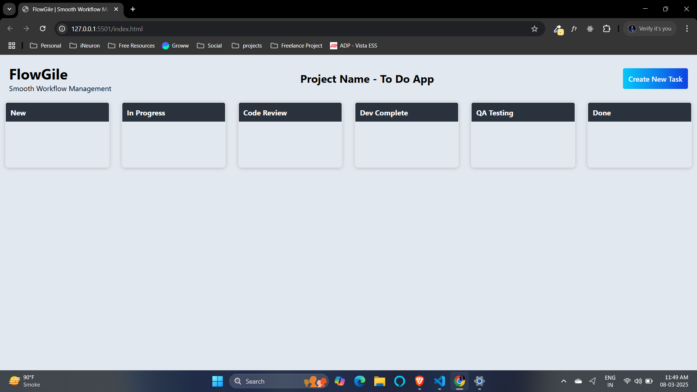
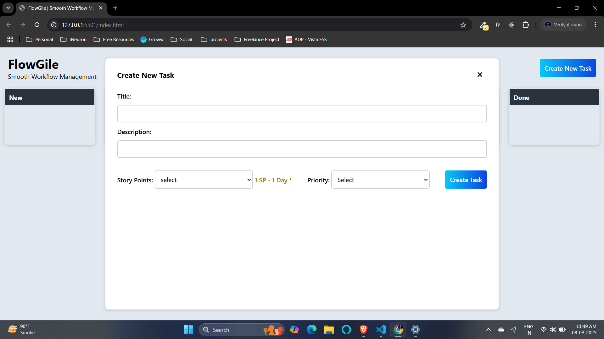
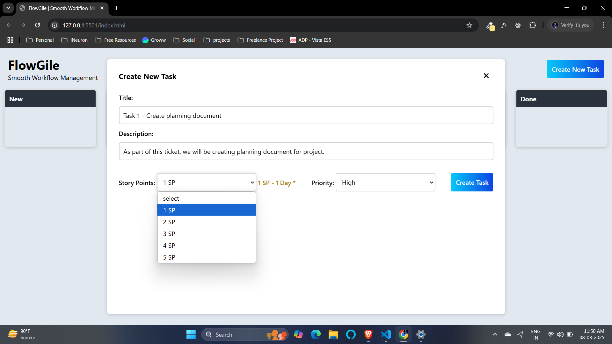
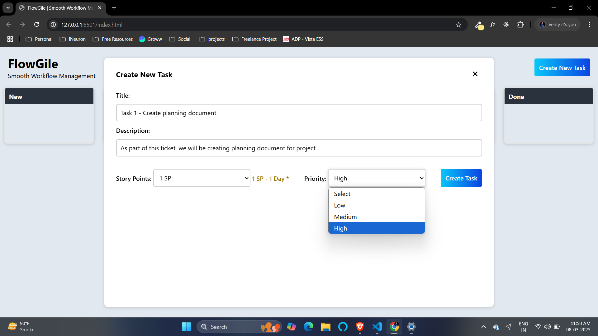
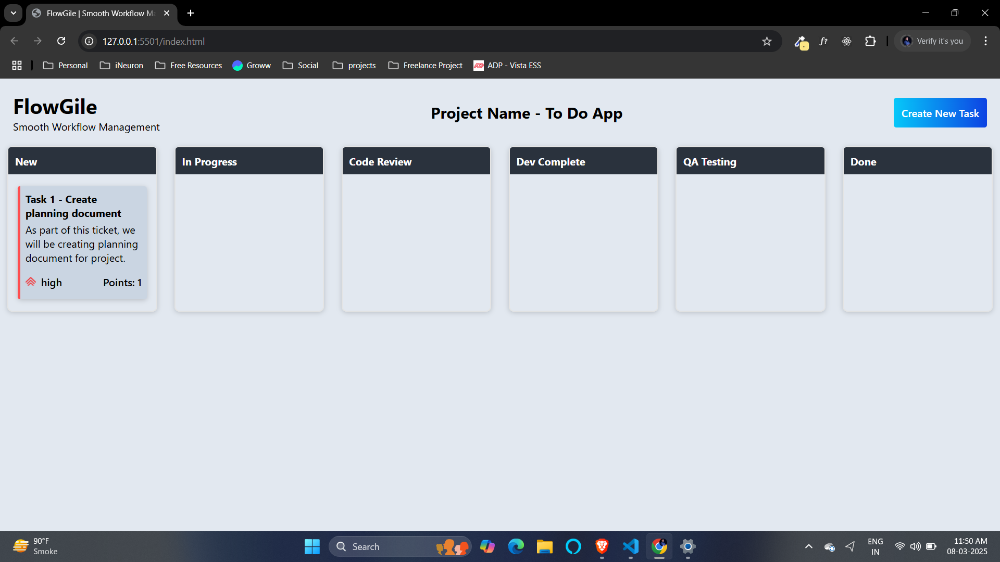
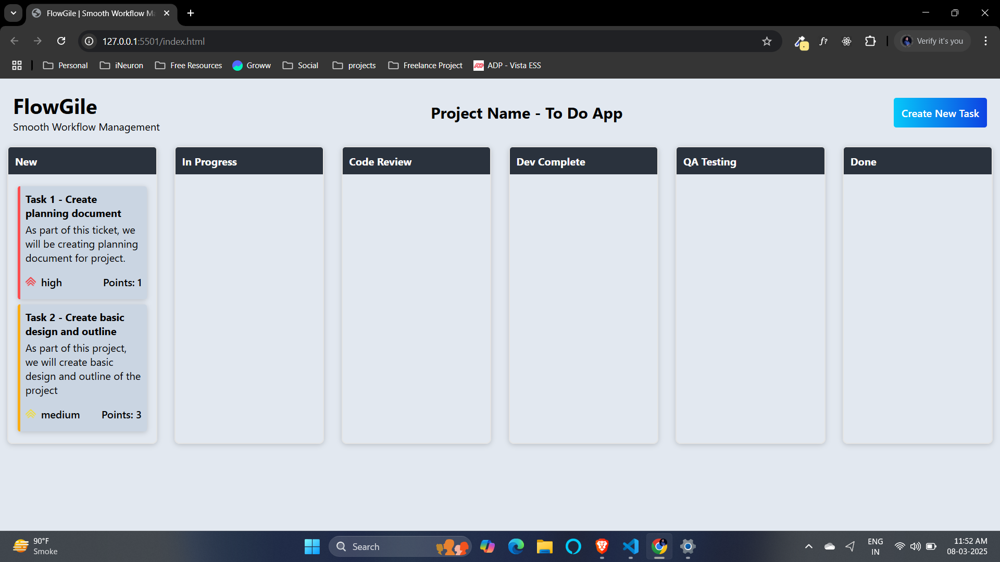
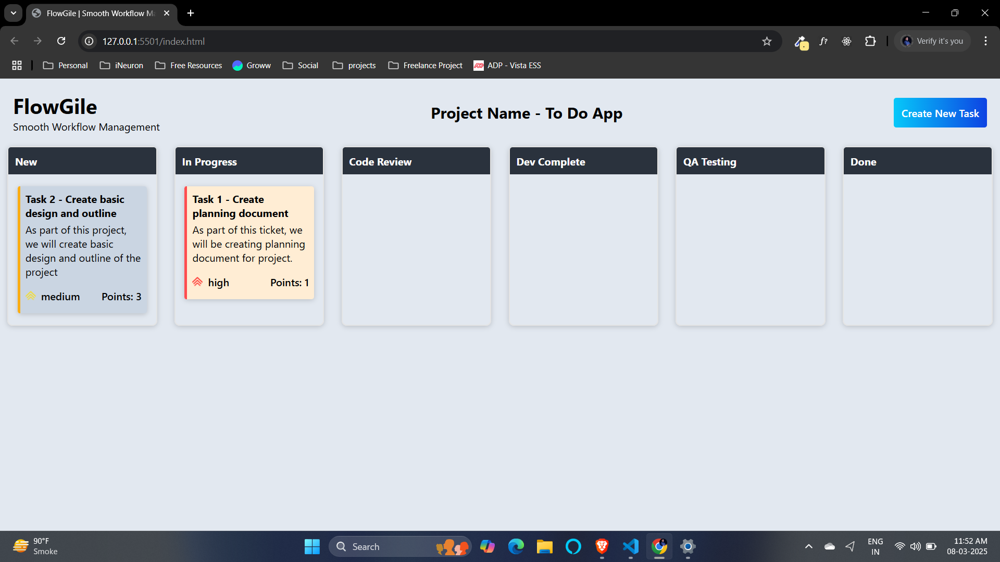
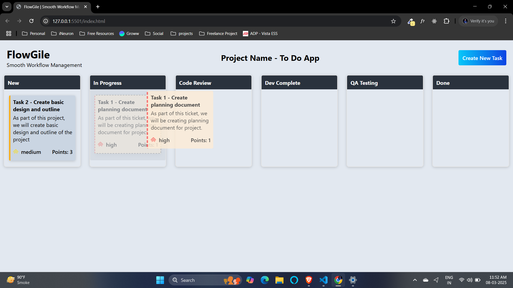
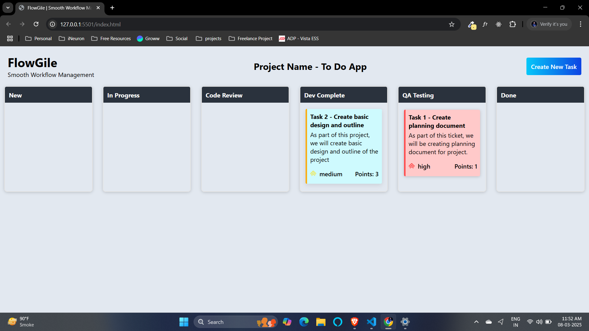
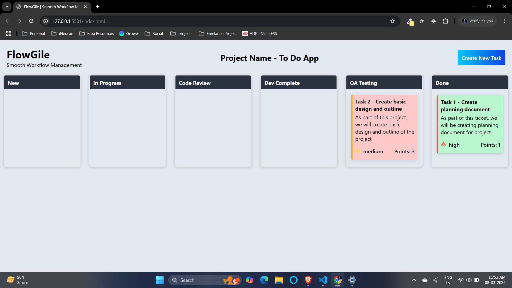

# Flowgile

Flowgile is a project designed to provide a streamlined and intuitive workflow management system, helping users efficiently manage tasks and projects.

## 🔗 Live Demo

[Flowgile](https://diliprathodrd.github.io/flowgile)

## 🚀 Features

- Task and project management
- Intuitive UI/UX
- Drag-and-drop functionality
- Track with story points and priority

## 🚀 Future Planned Features

- Add multiple projects
- Assign tasks to different developers
- Admin board to track work of every developer
- Allow to add comments under tasks while changing its status

## 📂 Installation

To run this project locally, follow these steps:

1. Clone the repository:
   ```sh
   git clone https://github.com/diliprathodrd/flowgile.git
   ```
2. Navigate to the project directory:
   ```sh
   cd flowgile
   ```
3. Open `index.html` in your browser or use a local development server.

## 💻 Project Snapshots












## 🛠️ Technologies Used

- HTML
- CSS
- JavaScript
- GitHub Pages (for deployment)

## 📜 License

This project is open-source and available under the [MIT License](LICENSE).

## 🤝 Contributing

Contributions are welcome! Feel free to fork the repository and submit pull requests.

## 📧 Contact

For any inquiries, reach out to [Dilip Rathod](https://github.com/diliprathodrd).
